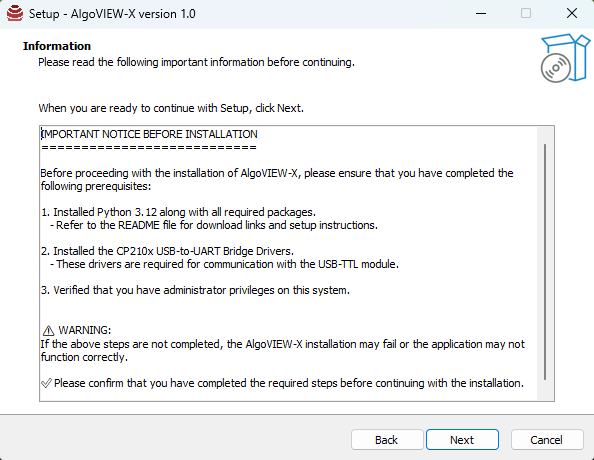

# 🚀 AlgoVIEW-X Installation Guide

This document provides a step-by-step installation process for **AlgoVIEW-X** along with all required dependencies.  
Please follow the steps carefully in the correct order.
<!-- [AlgoVIEW-X Setup Files](drive link) -->

## 📦 Prerequisites

Before installing AlgoVIEW-X, ensure you have the following:

1. **UART Driver** (CP210x USB-to-UART Bridge Driver)  
2. **Python** (Version 3.12 or above)  
3. **LibInstaller** (Python dependencies installer)  
4. **AlgoVIEW-X Application**  

⚠️ **Note:** Administrator privileges are required during installation.  

---

### 🔹 Install UART Driver

The application communicates with the USB-TTL module using the **CP210x driver** between AlgoVIEW hardware and software.  

- Driver files are available in the **`CP210x_Universal_Windows_Driver`** folder.  

**Instructions:**
1. Run the installer (`Right-click → Install`).  
2. Follow the installation process until completion.  
3. Restart your PC if prompted.  

✅ **Verification:**  
Open **Device Manager** → Expand **Ports (COM & LPT)** → Your USB-TTL device should appear without errors.  


---

### 🔹 Install Python

- Recommended version: **Python 3.12 or above**.  
- Download from:  
  - [Python.org](https://www.python.org/downloads/release/python-3135/)  
  - [Microsoft Store](https://apps.microsoft.com/detail/9NCVDN91XZQP?hl=en-US&gl=US)  

**Instructions:**
1. Run the Python installer (`Right-click → Run as Administrator`).
<br>


2. ✅ **Important:** Select **“Add Python to PATH”** before proceeding.
<br>


3. Complete the installation process.
<br>


✅ **Verification:**  
Open **Command Prompt (CMD)** or **PowerShell** and run:  

```bash
python --version
```
Expected Output: `Python 3.12.x`

---

### 🔹 Run LibInstaller

- The **LibInstaller** will automatically install all required Python dependencies. 

**Instructions:**
1. Locate and run the LibInstaller file (Double-click to start).
2. Follow the on-screen instructions and press Enter if the process has executed successfully.


---

### 🔹 Install AlgoVIEW-X Application

- The **LibInstaller** will automatically install all required Python dependencies. 

**Instructions:**
1. Run the AlgoVIEW-X setup file.
<br>


2. Follow the installation wizard step-by-step.
<br>



3. Once installed, launch the application from the Start Menu or Desktop shortcut.
<br>


## ⚠️ Troubleshooting Guide

If the installation of **AlgoVIEW-X** or its dependencies fails, follow the steps below to resolve common issues.

### 1. UART Driver Installation Issues

- If the provided driver files are corrupted, download the latest drivers from the official website:  
  👉 [CP210x Universal Windows Driver](https://www.silabs.com/software-and-tools/usb-to-uart-bridge-vcp-drivers?tab=downloads)  

- Ensure **Windows Driver Updates** are installed.  
- Check for and install any pending **Windows Updates**.

---

### 2. Python & LibInstaller Issues

- Verify that you have the latest version of **Python 3.12 (or higher)** installed.  
  - You can download it from the official [Python website](https://www.python.org/downloads/) or via the [Microsoft Store](https://apps.microsoft.com/detail/9pnrbtzxmb4z?hl=en-US&gl=IN).  

- If **LibInstaller** fails, re-run the installer to ensure all required libraries are correctly installed.  

- If the problem persists, run the installation commands manually through **Command Prompt (Run as Administrator)**.

### Libraries to be installed

```
pip install pyside6
```
Expected Output:


```
pip install numpy
```
Expected Output:


```
pip install pyserial
```
Expected Output:


```
pip install pandas
```
Expected Output:


```
pip install matplotlib
```
Expected Output:


---

### 3. AlgoVIEW-X Installation Issues

- Confirm that **UART Driver** and **Python with required libraries** are successfully installed.  
- Ensure your system is updated with the latest patches and software versions.  
- Restart your device if necessary.  

---

✅ Following these steps should resolve most installation-related problems. If issues continue, please reach out to the support team with detailed logs and error messages.

